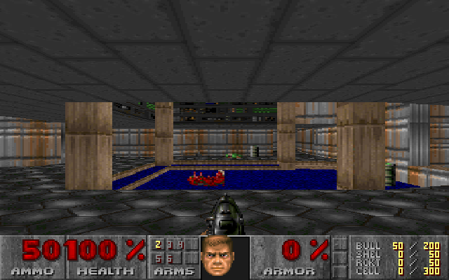

# Duum

A Doom engine written in Python. No native code, no third-party packages —
`struct` and `math` from the standard library, and nothing else.



It loads a real IWAD and draws a first-person, BSP-traversed, texture-mapped,
perspective-correct view of it, with sprites, doors, lifts, monsters,
hitscan and projectile combat, pickups and a status bar. The BSP walk, the
portal clipping, the texture mapping, the thing projection and every line of
the game logic are Python.

Duum began as an app for [UnoDOS](https://github.com/hmofet/unodos) and is
now its own thing: it runs anywhere CPython does.

## Quick start

```bash
python -m duum path/to/freedoom1.wad
```

Or grab the single file — `dist/desktop/duum.py` is the whole game in one
`.py` with no install step:

```bash
python duum.py path/to/freedoom1.wad
```

Run it with no argument and it looks for a WAD in the current directory,
next to itself, and in your Documents folder.

Controls: arrows or WASD to move and turn, `,`/`.` (or Q/X) to strafe,
Ctrl or F to fire, Space or E to open and use, 1–6 to pick a weapon, Esc to
quit.

## You need a WAD

Duum is the engine. The WAD holds the levels, textures and sounds, and is
not ours to ship, so none is bundled.

- **[Freedoom](https://freedoom.github.io/download.html)** — free, freely
  redistributable, and what the test suite runs against.
- **DOOM1.WAD** — the original shareware episode, still legally downloadable.

Commercial IWADs (`DOOM.WAD`, `DOOM2.WAD`, …) work too if you own them.

## Speed, honestly

Duum splits in two, and the halves behave differently:

- **`render()`** — the geometry. Pure Python, and roughly *flat* in
  resolution because it works in ~220 internal columns.
- **`draw()`** — the rasteriser, writing every pixel. Linear in pixel count.

Measured on a Ryzen 7 5700X3D, CPython 3.12, Freedoom E1M1:

| resolution | render | draw | total | fps |
|---|---|---|---|---|
| 640×400 | 3.2 ms | 208.3 ms | 211.5 ms | 4.7 |
| 518×382 | 3.2 ms | 161.7 ms | 164.9 ms | 6.1 |
| 400×300 | 3.4 ms | 95.5 ms | 98.9 ms | 10.1 |
| **320×200** | **3.1 ms** | **50.9 ms** | **53.9 ms** | **18.5** |
| 256×160 | 3.1 ms | 31.9 ms | 35.0 ms | 28.6 |
| 160×100 | 2.6 ms | 13.8 ms | 16.4 ms | 60.9 |

So the engine is not the bottleneck — the per-pixel loops are, by a factor of
about twenty. `--size` is therefore the speed control; 320×200 is Doom's own
resolution and the default.

### Making it fast

`duum/raster.py` is the seam. It is a plain object with a span-writer
contract:

```
width() / height()
clear(color)
fill_rect(x, y, w, h, color)
text(x, y, s, color)
wall_span(x, w, y0, count, grid, tw, th, texcol, v0, dv, pal, sh)
mask_span(...)                     # as wall_span, but index 0 is transparent
flat_span(x, w, y0, count, grid, pal, a, ycen, dx, dy, wx, wy, lf)
```

Supply your own object with those methods and the engine does not change.
That is exactly how UnoDOS gets its speed: the same Python engine, with the
span writers in C. `tools/duum_golden.py` will tell you whether your
replacement is pixel-exact.

## Layout

```
duum/
  engine.py          the engine: BSP walk, clipping, texturing, game logic
  raster.py          reference rasteriser — the seam to replace for speed
  hostapi.py         picks the platform (below)
  hosts/desktop.py   file I/O, clock, key state, on the standard library
  frontends/tkwin.py a tkinter window
tools/
  build.py           fold the package into the single-file distributions
  bench.py           the table above
  duum_golden.py     pixel-exact regression gate
  duum_verify.py     independent geometry oracle
```

The platform surface is deliberately tiny — `size`, `read_at`, `beep`,
`quiet`, optional `ticks` and `keys_down`, and an `App` base class. That is
the entire list of things a port has to provide.

## Building the distributions

```bash
python tools/build.py --check path/to/freedoom1.wad
```

writes two single files:

- `dist/desktop/duum.py` — engine + rasteriser + tkinter frontend + CLI.
- `dist/unodos/DUUM.PY` — engine only; UnoDOS supplies `uno` and a C canvas.

Both are generated; edit the package and rebuild. A Windows `.exe` is built
with [PyInstaller](https://pyinstaller.org):

```bash
python packaging/build_exe.py
```

PyInstaller is a build-time tool only — the `.exe` embeds a Python
interpreter and Duum, and nothing else.

## Tests

Three gates, all runnable against any IWAD:

```bash
python tools/duum_verify.py --wad freedoom1.wad     # geometry oracle
python tools/duum_golden.py save --wad freedoom1.wad
python tools/duum_golden.py check --wad freedoom1.wad
python tests/smoke_window.py freedoom1.wad          # the frontend actually runs
```

`duum_verify.py` is a second, independent renderer: a clean-room per-column
raycaster written from the public Doom specifications that shares no code and
no algorithm with the engine's BSP walk. It checks every screen column's
surface classification and wall texture choice across 68 viewpoints, and
separately asserts that the display list tiles every column exactly once —
no holes, no overdraw. It must report **0 failing views**.

`duum_golden.py` hashes rendered frames across 54 viewpoints, which is the
check you want when optimising: "looks the same" is not good enough, and it
catches a one-pixel drift.

## Licence and credits

Duum is licensed under the **Mozilla Public License 2.0** — see
[LICENSE](LICENSE).

Written from the public Doom specifications (the unofficial Doom specs and
the WAD format documentation), not from a port of the original C. Doom is a
trademark of id Software; Duum is not affiliated with or endorsed by them.
Freedoom is a separate project under its own BSD-style licence.
